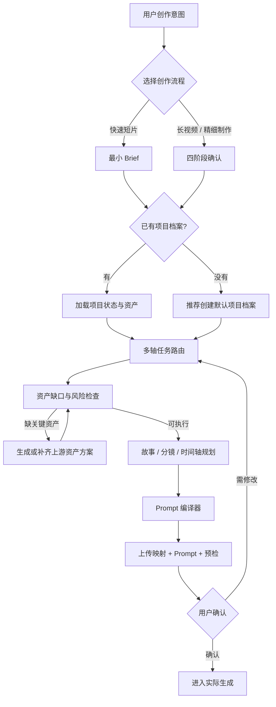
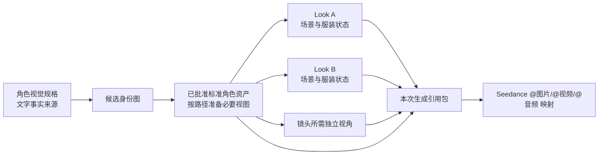

# Seedance 2.5 视频 Prompt Skill 总体规划与系统设计

## 文档状态

- 文档性质：整体设计基线
- 当前版本：v0.3
- 更新时间：2026-09-12
- 目标 Skill：`write-seedance-video-prompts`
- 视频目标模型：Seedance 2.5
- 当前阶段：保留既有路由及官方能力基线，增加创作任务与迭代闭环；生成效果仍待真实项目验证

本文保留 v0.1 形成之前的整体设计过程，并记录当前设计基线。详细执行规则和字段分别以 `SKILL.md`、`references/` 为准；不在本文重复维护官方参数。v0.2 的变化与验证边界见 `docs/plans/2026-09-06-v0.2-update.md`。

## 文档导航

v0.3 设计增量：创作意图先转成镜头任务与可见证据，再进入既有编译器；空间/表演、必要状态资产、代表镜头试拍及粗剪反馈按需启用，不新增路由维度或确认门。详见 [创作与迭代](../../references/creative-direction.md)。

独立文件项目继续使用后文的轻量档案；工作台项目以其现有对象和版本为唯一主档。Seedance 负责创作编译，工作台工作流负责保存与关系映射；导出 YAML 是交换快照，不另设自动双向同步。本文后续 YAML 字段与目录结构均为独立项目约定，不强制工作台按文件镜像实现。第三方案例不改变官方模型上限，不引入固定重抽次数或效果保证。

- 第 1–5 节：背景、目标、边界、原则和总体架构；
- 第 6–7 节：多轴路由和两条创作路径；
- 第 8–10 节：项目档案、角色资产和图片模型适配；
- 第 11–16 节：故事规划、Prompt 编译、能力基线、案例与交付契约；
- 第 17–21 节：仓库结构、演进路线、设计决策、验证和资料来源。

## 1. 背景与问题

视频 Prompt 不是把镜头、人物、风格和参数全部填入一份大模板。不同任务的控制重点不同：

- 简短 demo 更重视快速收敛和低沟通成本；
- 长视频或高价值成片更重视前置资产、分镜和分段验收；
- 有些视频适合交给模型编排故事节奏；
- 有些产品展示、卡点动作和对白必须按秒控制；
- 主要人物的一致性不能仅靠重复文字描述；
- 多场景中，同一角色身份应稳定，但服装、妆发和剧情状态必须允许变化；
- Seedance 的生成、续写、编辑、首尾帧、创意参考和视频融合具有不同输入协议，不能使用同一个固定骨架处理。

因此，本项目不是“Prompt 模板集合”，而是一个路由型创作系统：先判断任务，再选择工作流、资产、规划粒度和控制锚点，最后编译出本次真正需要的 Prompt。

## 2. 目标

建立一个可共享、可持续维护、与使用者本地环境解耦的 Seedance 2.5 视频创作 Skill，覆盖：

1. 引导用户选择快速短片或长视频/精细制作流程；
2. 加载或建立项目级状态与资产档案；
3. 管理主要人物、次要人物、多场景 Look、场景、道具、声音和参考视频；
4. 在生成、续写、编辑、拼接等操作之间正确路由；
5. 根据内容风险选择故事线、节拍、镜头或精确时间轴；
6. 按需使用角色资产、首尾帧、动作视频、白模、多宫格和音频等控制锚点；
7. 把确认后的信息编译为可直接使用的 Seedance 2.5 生成包；
8. 在高成本生成前暴露缺口、冲突和返工风险。

## 3. 非目标与边界

- 不建设跨视频模型的通用 Prompt Skill；视频目标固定为 Seedance 2.5。
- GPT、Gemini、Seedream、Grok Image 只作为角色和视觉资产的生图目标模型。
- 不把文字“身份核”包装成视频人物一致性的直接解决方案。
- 不要求每次填满所有 Prompt category。
- 不承诺时间码等同于帧级确定性。
- 不用冗长负向词表掩盖资产缺失、动作含混或镜头设计问题。
- 创作流程不自动调用生图/视频生成、执行付费操作或安装全局 Skill；安装按目标客户端的当前约定进行，不依赖特定发布工具，方式见 README。
- 当前版本保留精简案例模式索引，不做完整案例数据库、模型 API 封装或自动化项目初始化脚本。

## 4. 设计原则

### 4.1 先路由，后提问

新创作任务尚未明确流程时，第一问是创作流程选择：

1. 快速短片；
2. 长视频 / 精细制作。

路径确定之后，第二步确认是否已有项目目录和资产档案。已提供的答案、目录与批准记录直接沿用；单纯修改/评审现有 Prompt 不重新立项。

### 4.2 自适应追问

一次只问当前最影响下一步的一个问题。低风险细节可推断并标注假设；身份、产品、时长、画幅、语言、核心动作在定稿前确认。已有授权在原范围内继续有效，写 Prompt 不等于执行生成。

### 4.3 最低足够控制

从最低但足够的规划粒度和资产数量开始。只有当时序、一致性、物理交互或返工风险提高时，才增加时间码、分镜、参考图或拆段。

### 4.4 资产先于文字重复

主要人物先通过统一视觉规格生成标准角色参考资产，再在视频中复用这些资产。文字规格负责生成和验收资产，参考图负责视频中的身份锚定。

### 4.5 身份与 Look 分离

角色身份是长期稳定层；服装、妆发、配饰、脏污、湿润和剧情状态属于场景 Look。换装不应重新定义身份。

### 4.6 项目状态可追溯

聊天不是唯一状态来源。稳定决策写入 Markdown，机器可读状态写入 YAML；资产必须有 ID、版本、状态和用途。

### 4.7 Prompt 是编译结果

最终 Prompt 由当前操作和风险决定。模块可选、顺序有逻辑、指令无冲突；不以模板完整度衡量质量。

## 5. 系统总体架构



系统分为六层：

1. **入口路由层**：选择快速或长/精细流程；
2. **项目状态层**：保存 Brief、Gate、资产和决策；
3. **任务决策层**：确定操作、策略、粒度和控制锚点；
4. **资产层**：管理角色身份、Look、场景、道具、声音和参考素材；
5. **规划与编译层**：生成故事、分镜、时间轴和最终 Prompt；
6. **预检与执行边界**：暴露风险，并在付费生成前取得确认。

## 6. 多轴路由系统

一次任务分别确定以下维度。它们不是一个大单选题，而是可组合的正交轴。

### 6.1 创作流程轴

- 快速短片；
- 长视频 / 精细制作。

它决定沟通和确认强度，不直接决定 Prompt 的镜头写法。

### 6.2 操作类型轴

- 从零生成；
- 视频续写；
- 智能编辑；
- 组合 / 无缝拼接。

它决定输入协议。编辑按修改类型选保持项；续写从源片末态承接，可以一镜到底或切镜换景；拼接先区分普通后期组接与模型生成桥接，再按精度决定转场约束。

### 6.3 生成策略轴

- 单次 4–30 秒；
- 30–180 秒超长直出；
- 基础片 + 续写，最终约 60 秒以内；
- 多片段生成后拼接。

长视频不等于默认超长直出。若局部返工成本高、Look 多或逐段审批，优先多片段生成；这是本 Skill 的成本偏好，不是官方限制。用户选择直出时完成相应确认后支持，不强制改成分段。

### 6.4 规划粒度轴

- 意图驱动；
- 故事节拍驱动；
- 逐镜头驱动；
- 精确时间轴驱动。

时间码属于规划粒度，不是独立的模型能力模式。定时事件、严格因果或镜头不可重排时补足局部控制；可用故事节拍与关键时间段混合规划，不必整片逐秒化。

### 6.5 控制锚点轴

- 标准角色资产；
- 场景 Look 资产；
- 首帧 / 尾帧；
- 动作或运镜参考视频；
- 创意参考视频；
- 多宫格分镜；
- 粗白模 / 细白模；
- 音频。

每个锚点说明参考职责与必要排除项；局部使用时分别记录源素材选段与目标生效范围。多宫格、白模和创意参考不与时间轴构成互斥模式。粗白模负责所需动态/空间骨架，细白模用于完整动画渲染，但不机械照抄所有动作。

### 6.6 约束模块轴

- 人物身份与 Look；
- 场景、时间、天气和光线；
- 动作、物理关系和因果顺序；
- 构图、机位和运镜；
- 对白、语言、音效、环境声和音乐；
- 镜头内和镜头间连续性；
- 必须保持不变的元素；
- 必要负向约束。

## 7. 两条创作路径

### 7.1 快速短片路径

适用于快速 demo、方向验证和低资产复杂度内容。

默认只确认：

- 一句话意图、用途、时长和画幅；
- 主要主体及必须保留特征；
- 一个最关键动作、转折或结尾；
- 对白、环境声、音效、音乐或无声策略；
- 可用素材和一个主要风险。

出现主要人物时，最低角色资产包为：

- 一张身份清晰的近景或四分之三视角图；
- 一张当前 Look 的独立全身图；
- 镜头确实需要时，再补充其他视角。

快速路径不强制多视图。用户知情批准本次 demo 使用 `candidate` 时，记录引用包级许可，不把候选升级为标准资产；未许可时可先给草稿。仅修改已有视频且保留原人物时，源视频可以承担身份依据，不要求重制角色包。

### 7.2 长视频 / 精细制作路径

适用于超过 30 秒、多场景、多 Look、复杂产品展示、多人交互、对白或高重抽成本内容。

默认经过四个 Gate：

1. **Brief Gate**：目标、受众、时长、画幅、核心表达、声音和不可改变项；
2. **Asset Gate**：角色标准资产、Look、产品、场景、道具、音频和参考视频；
3. **Storyboard Gate**：段落、镜头或时间轴，以及动作、换装和声音连续性；
4. **Final Package Gate**：生成设置、上传顺序、最终 Prompt、风险和分段顺序。

Gate 状态建议为：

- `pending`：尚未确认；
- `approved`：已通过；
- `skipped_with_risk`：用户知情后跳过；
- `blocked`：关键输入不足，不能继续。

用户可以跳过 Gate，记录范围与风险；不能因此跳过硬性输入限制或伪造批准。资产门以前先有粗略故事/镜头需求，最终分镜后再补必要资产，不提前制造完整库。决策变化只重开受影响的门与引用包。

## 8. 项目级档案

路径确定后，若项目目录和资产档案尚不明确，再询问：

- 有：读取并适配现有结构；
- 没有：推荐从 `assets/project-template/` 创建默认项目档案；
- 用户暂不创建：可以继续快速讨论，但明确哪些状态只存在于当前对话中。

默认档案包含：

- `project.yaml`：项目身份、流程、生成设置和 Gate 状态；
- `brief.md`：人类可读的目标、故事、视听方向、假设和决策；
- `asset-registry.yaml`：资产、版本、状态、归属和生成引用包；
- `assets/`：角色、Look、场景、道具、音频和源视频；
- `storyboards/`、`prompts/`、`outputs/`。

YAML 是可执行状态，Markdown 是创作与决策记录；两者不互相替代。

v0.2 只做兼容字段扩展：`assets[]` 统一登记实际文件，人物/Look 等逻辑实体关联资产 ID；`video.clips[]` 在需要时保存片段、Look、入出状态和续写时长；`gate_decisions[]` 记录重要确认依据。保留 `schema_version: 1`，不添加状态引擎或自动迁移工具。字段定义与示例只维护在 `references/project-assets.md`。

## 9. 角色与视觉资产体系



### 9.1 角色视觉规格

以文字定义年龄/族裔、脸型与骨相、肤色肤质、面部标志、眼睛与眼神、发型发色、体型比例、整体气质、不可漂移项和允许变化项。

它用于：

- 生成候选角色资产；
- 验收不同视图是否为同一人物；
- 生成新的服装和场景 Look；
- 在资产漂移时追溯标准。

它不直接承担正式视频中的身份锁定。

### 9.2 标准角色参考资产

新建长/精细项目的主要人物逐步形成以下标准包；快速路径按第 7.1 节最低包执行，已有足够资产则复用：

- 多视图角色设定图；
- 独立面部近景；
- 独立标准全身图；
- 分镜需要的侧面、背面、手部、表情和特殊姿态。

多视图图用于整体校对，独立视图用于 Seedance 清晰引用。标准角色资产经批准后跨场景、跨视频段复用。

### 9.3 场景 Look

每个 Look 关联一个固定 `character_id`，拥有独立 `look_id`。记录服装、鞋、配饰、妆发和剧情状态，以及适用的场景/镜头范围。

同一镜头不能引用互相冲突的多个 Look。服装变化若是剧情事件，需要定义起始 Look、目标 Look 和变化触发方式。

### 9.4 次要人物

次要人物默认通过 Prompt 描述，不强制生成参考图。描述维度来自官方人物公式：

```text
年龄/族裔 + 肤色肤质 + 面部标志 + 眼睛与眼神 + 发型发色 + 服装与材质 + 体态/表情/气质
```

以下情况升级为受管资产：

- 跨多个镜头或视频段重复出现；
- 承担近景、特写或对白；
- 与主要人物发生复杂肢体或道具交互；
- 身份/服装错误会破坏叙事；
- 后续需要复用或审批。

### 9.5 资产状态

统一使用：

- `planned`：已识别，尚未制作；
- `candidate`：已有候选，尚未确认；
- `approved`：允许进入正式引用包；
- `superseded`：被新版本替代但保留追溯；
- `blocked`：存在身份冲突、版权、质量或文件问题。

长视频正式生成默认只使用 `approved` 的关键角色和 Look 资产。

### 9.6 本次生成引用包

引用包为单个视频片段选择最少且足够的资产，并记录：

- 稳定资产 ID；
- 目标镜头或片段；
- 上传顺序；
- `@图片N`、`@视频N`、`@音频N` 映射；
- 每项“参考什么 / 不参考什么”；
- 需要时标明源素材选段与目标片段生效区间，不能混淆两个时间轴；
- 冲突检查结果。

稳定资产 ID 不等于本次上传编号。上传编号每次可变，但必须在 Prompt 和映射表中一致。

## 10. 图片资产生成适配

所有目标图片模型共享一份统一视觉规格。每轮资产生成选择一个目标模型：

- GPT；
- Gemini；
- Seedream；
- Grok Image。

适配器只改变 Prompt 表达和当前模型已核实的输入方式，不改变角色事实。未核实当前官方能力时，不虚构模型专用参数、权重语法、参考图上限或身份锁定强度。

长/精细路径的推荐生产顺序（快速路径不强制多视图）：

1. 角色视觉规格；
2. 候选身份图；
3. 选择并批准身份母版；
4. 多视图角色设定图；
5. 独立近景和独立全身；
6. 镜头要求的补充视角；
7. 基于同一身份母版派生场景 Look；
8. 验收并登记版本。

有可用生图工具时，先展示本轮清单和模型，确认已有授权覆盖后生成，超出范围再询问；没有工具时仅交付 Prompt 和上传说明。多视图库存与单次上传选择分开，不为完整而上传整套资产。

## 11. 故事与镜头规划

规划粒度根据风险递增：

1. **意图驱动**：一句话概览和大体故事，让模型自行编排；
2. **节拍驱动**：写清事件顺序、转折和情绪变化；
3. **镜头驱动**：逐镜头写构图、动作、机位、运镜和转场；
4. **时间轴驱动**：按秒写事件、动作、镜头和声音。

粒度升级条件包括：

- 事件必须在指定秒数发生；
- 多主体存在严格动作因果；
- 需要对口型或音画卡点；
- 产品结构和 reveal 不能自由重排；
- 镜头间需要明确空间、服装或动作连续性；
- 一次生成过长导致局部返工代价过高。

时间轴是强引导而非帧级保证。不可妥协时，缩短片段并逐段验收。

人物表演增加“阶段意图—可见动作—触发与变化”的表达；潜台词解释动作含义，不替代可见行为。不把临时含泪/微笑等状态写成永久身份特征。

## 12. Prompt 编译系统

Prompt 编译器根据操作类型和风险，从以下模块中选择必要项：

1. 生成设置；
2. 上传素材映射和参考范围；
3. 一句话全片概览；
4. 故事线、节拍、镜头或时间轴；
5. 主要人物身份与当前 Look；
6. 次要人物文字约束；
7. 场景、时间、天气、光线和美术；
8. 动作、物理关系和因果顺序；
9. 构图、机位和运镜；
10. 对白、语言、环境声、音效和音乐；
11. 连续性、保持项和最终状态；
12. 当前任务真正需要的负向约束。

### 12.1 从零生成协议

```text
素材映射（可省）+ 一句话概览 + 故事线/时间轴 + 全局补充（置于末尾）
```

### 12.2 编辑协议

```text
目标对象 + A→B 改动 + 生效时间 + 参考素材 + 保持项
```

按局部增删改、声音、视角、绿幕/合成选择保持项，不拆成新的工作流。改视角允许合理投影/遮挡变化；去 BGM 不等于静音；无新字幕不等于删原字幕。

### 12.3 续写协议

```text
源片末态 + 连接类型 + 新增时长/计时基准 + 保持项/允许变化 + 新增剧情与终态
```

### 12.4 拼接协议

```text
区分普通组接与生成桥接 + 两端内容 + 转场选择/机制 + 必要连续性
```

### 12.5 Prompt 质量原则

- 写清主体、对象、方向、顺序和触发条件；
- 素材引用必须有明确职责；
- 避免同义词堆叠和互相冲突的风格词；
- 正向设计优先，负向约束只处理高风险可观察错误；
- 不需要字幕、BGM、旁白或额外人物时明确写出；
- 资产缺口不能用更多文字弥补。

“全局补充（结尾）”不是故事结尾，而是放在 Prompt 末尾的全片规则。对白语言、音色、字幕语言、画内文字及品牌例外分开；全局与局部不能互相取消。时间码、物理规则与无硬切等约束按用户意图使用，不普遍禁止有意的超现实或剪辑效果。

## 13. Seedance 2.5 能力基线

数值、适用入口、复核日期与手册修订号统一维护于 `references/seedance-2.5-reference.md`。本轮依据修订 8839；未获历史正文读取权限，不能将旧 Skill 未覆盖的规则一律认定为本轮新增。

设计上分四种证据：明确参数、稳定性建议、案例写法、展示评价。本 Skill 的“优先分段”“角色资产最低包”另属制作偏好。文件数、主体数与项目总角色数分开；素材规格不等于输出规格。没有成片实测，不能把“完美/无损”等展示语当结果保证。

## 14. Good Case 归纳方式

案例不按“好看的案例”平铺，而按可复用控制模式归档；v0.2 已落实到 `references/case-patterns.md`：

- 故事线驱动；
- 精确时间轴；
- 主角色一致性；
- 多场景 Look 变化；
- 首尾帧形态或构图控制；
- 动作/运镜参考；
- 创意参考；
- 多宫格分镜；
- 白模替换；
- 视频编辑；
- 续写；
- 无缝转场与视频融合；
- 对白、音效和音乐协同。

索引记录手册章节/内容关键词、控制目的、可迁移规则与使用限制；不复制全部长 Prompt，不将官方展示认定为本项目实测成功。案例只按需读取，不直接堆进 `SKILL.md`。

## 15. Negative Case 与风险处理

以下情况不直接编译正式生成包：

- 正式新生成所需主角批准资产缺失（本次候选 demo 许可、保留原角色的源片编辑按各自规则处理）；
- 同一人物的标准资产在脸型、发型或体态上冲突；
- 当前场景引用多个互斥 Look，且未定义有意的换装事件；
- 上传编号重复，或 Prompt 引用了不存在的素材；
- 编辑任务缺少目标、变化、生效时间或保持项；
- 续写时长或计时基准互相矛盾，接续状态不明；
- 素材硬性超限、全局与局部声音/语言等重要要求冲突。

超出稳定区间、多人接触、文字/UI、科普计数、产品结构等作为风险与验收项，给最小改善方案，不一律阻断。低精度转场允许模型选择候选方式，有意硬切不算失误。缺输入时可以给草稿，不假装已有可执行终包。

优先给最小补救方案，例如：补一张独立全身图、确认一个 Look、缩短片段、减少同时动作、拆镜头、重命名素材或明确声音策略，不默认推倒整个项目。

## 16. 最终生成包契约

每个可执行生成包至少交付：

### 生成设置

- 创作路径；
- 操作类型与生成策略；
- Seedance 模式；
- 时长、画幅和清晰度；
- demo/正式/草稿用途与状态；续写另列源片、新增、最终时长和时间基准；
- 规划粒度。

### 上传与引用映射

- 上传顺序；
- 资产 ID 与文件；
- `@图片/@视频/@音频` 编号；
- 每项参考职责与排除项。

### 可复制 Prompt

只包含当前任务需要的模块，并与素材映射完全一致。

### 生成前检查

- 已满足条件；
- 当前假设；
- 模型与素材风险；
- 仍需确认项；
- 高风险验收重点。

## 17. 仓库文件架构

```text
write-seedance-video-prompts/
├── README.md
├── SKILL.md
├── agents/
│   └── openai.yaml
├── references/
│   ├── workflow-router.md
│   ├── project-assets.md
│   ├── prompt-compiler.md
│   ├── seedance-2.5-reference.md
│   ├── case-patterns.md
│   └── image-asset-generation.md
├── assets/
│   └── project-template/
│       ├── project.yaml
│       ├── asset-registry.yaml
│       └── brief.md
└── docs/
    ├── design/
    │   └── system-design.md
    └── plans/
        ├── 2026-08-03-v0.1-implementation.md
        └── 2026-09-06-v0.2-update.md
```

职责边界：

- `README.md`：GitHub 项目入口、快速使用和文档导航；
- `SKILL.md`：只保留入口、强制流程、条件路由和交付契约；
- `references/`：保存各领域的详细规则；
- `assets/project-template/`：保存新项目可复制状态模板；
- `docs/design/`：保存长期维护的整体设计基线；
- `docs/plans/`：保存阶段实施计划和完成状态。

## 18. 演进路线

### v0.1：系统骨架

- 双路径入口；
- 多轴路由；
- 项目和资产模板；
- 主要人物与 Look 层级；
- Prompt 编译规则；
- Seedance 官方事实速查；
- 图片模型适配契约。

### v0.2：手册对照、案例索引与离线前向验证

- 修正全局补充、续写、候选 demo 与多视图的规则冲突；
- 补充表演、局部参考、编辑、声音/文字和白模控制；
- 建立可追溯案例索引，明确官方示例自身的冲突；
- 以代表性请求验证路由/Prompt 行为；不等同于实际生图、视频效果与成本验证。

下一步先用真实快速短片和长视频项目验证，再决定是否需要下面的工具；版本路线是候选，不为凑版本增加模块。

### v0.3：项目初始化与检查工具

- 自动从模板创建项目目录；
- 校验 YAML、资产文件和上传引用；
- 检查资产 ID、Look 冲突、素材数量和时长；
- 生成单次引用包和 Prompt 文件。

### v0.4：生图适配器

- 分别验证 GPT、Gemini、Seedream、Grok Image 的当前官方能力；
- 建立模型特定 Prompt 转换和验收流程；
- 保持统一视觉规格为唯一事实来源。

### 后续候选

- 根据实际需要扩展现有片段入出状态，不另建重复连续性系统；
- 角色和 Look 版本差异检查；
- 分镜到生成包的半自动编译；
- 失败案例回流与路由规则更新；
- 在真实使用稳定后安装到全局 Skills 目录。

## 19. 关键设计决策记录

| 决策 | 选择 | 原因 |
| --- | --- | --- |
| 视频模型范围 | 只做 Seedance 2.5 | 通用层会稀释官方能力和 Prompt 细节 |
| Skill 组织 | 单一 Router Skill | 便于统一入口和持续维护 |
| 第一问 | 快速或长/精细路径 | 先决定沟通与成本控制方式 |
| 项目档案 | 主动询问，缺失时推荐创建 | 保证跨片段资产和决策可追溯 |
| 主要人物锁定 | 已批准参考图资产 | 文字描述不能稳定承担跨镜头身份一致性 |
| 次要人物 | 默认文字描述 | 降低不必要的资产成本 |
| 多场景服装 | 身份与 Look 分层 | 同一角色稳定，服装允许按场景变化 |
| 图片模型 | 统一规格 + 单目标适配 | 兼顾可迁移性和单次输出一致性 |
| 规划方式 | 四级粒度自适应 | 不机械填写完整模板 |
| 控制结构 | 多轴正交 | 时间轴、白模和分镜不是同类互斥选项 |
| 长视频 | 四 Gate + 可分段验收 | 降低高积分生成的返工浪费 |
| 付费生成 | 用户确认后执行 | 明确外部成本和执行边界 |
| 参考范围 | 维度与目标区间按需限定 | 避免局部参考污染全片，源选段和目标时段分开 |
| 续写控制 | 一镜到底/切镜均支持 | 保持项不能否定用户有意的场景与Look变化 |
| 规则强度 | 硬限制/建议/制作偏好分开 | 尊重直出、候选demo、风格化等实际意图 |

## 20. 验证标准

基础验证继续保留，v0.2 增加离线行为验证：

- Skill 结构验证器通过；
- `SKILL.md` 足够短，且所有 reference 路由有效；
- YAML 模板可以被标准解析器读取；
- 第一问和第二问顺序明确；
- 主要人物资产层级与 Look 管理不含混；
- Prompt 编译能覆盖生成、续写、编辑和拼接；
- 正式文件没有未完成占位符；
- 快速与长路径、局部编辑、换景续写、局部引用和超限拼接等代表性请求可正确处理；
- 案例中的矛盾不被抄入生成包，候选许可不冒充标准批准；
- 验证报告区分静态检查、离线答复与实际生成结果。

## 21. 资料来源

- Seedance 2.5 官方使用手册：https://bytedance.larkoffice.com/wiki/RXh5ww6EqighMdkVTMccm2d4n7e
- Skill 当前官方能力摘录：`references/seedance-2.5-reference.md`
- Skill 入口与执行规则：`SKILL.md`
- 仓库入口与文档导航：`README.md`
- v0.1 实施状态：`docs/plans/2026-08-03-v0.1-implementation.md`
- v0.2 更新与验证：`docs/plans/2026-09-06-v0.2-update.md`
